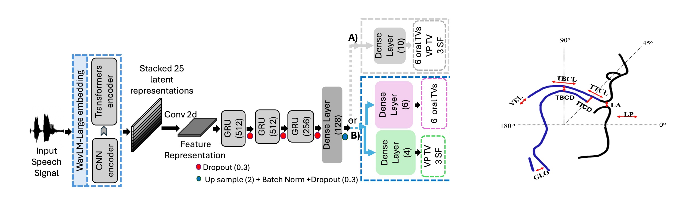

<p style="text-align:center;">

</p>

## Abstract
<div style="text-align: justify"> SRecent studies demonstrate the effectiveness of Self Su-
pervised Learning (SSL) speech representations for Speech
Inversion (SI). However, applying SI in real-world scenarios
remains challenging due to the pervasive presence of back-
ground noise. We propose a unified framework that integrates
Speech Enhancement (SE) and SI models through shared
SSL-based speech representations. In this framework, the
SSL model is trained not only to support the SE module in
suppressing noise but also to produce representations that are
more informative for the SI task, allowing both modules to
benefit from joint training. At a Signal-to-Noise Ratio of –5
dB, our method for the SI task achieves relative improvements
over the baseline of 80.95% under babble noise and 38.98%
under non-babble noise, as measured by the average Pearson
product–moment correlation across all estimated parameters..</div>
<br>

| Paper                                         
|---------------------------------------------------------------------------------------------------------|
| [**Speech Enhancement and Speech Inversion through Multi-Task Framework**](https://arxiv.org/abs/2601.14516) |

<br>

Please cite our work if you found it useful,

```
@article{tabatabaee2026towards,
  title={Towards noise-robust speech inversion through multi-task learning with speech enhancement},
  author={Tabatabaee, Saba and Espy-Wilson, Carol},
  journal={arXiv preprint arXiv:2601.14516},
  year={2026}
}
