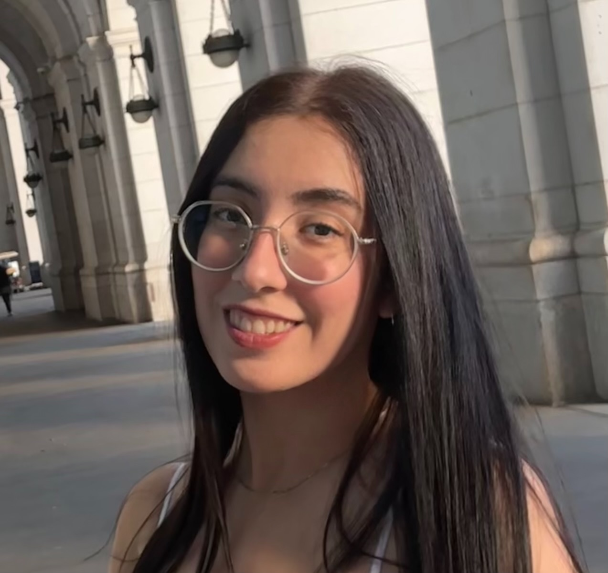

<table>
  <tr>
    <td width="200">
      
    </td>
    <td>
      
I'm Saba Tabatabaee, currently pursuing a Ph.D. in Electrical and Computer Engineering at the University of Maryland - College Park, where I'm working under the supervision of <a href="https://isr.umd.edu/clark/faculty/391/Carol-Espy-Wilson">Prof. Carol Espy-Wilson</a> at the <a href="https://scl.umd.edu/">Speech Communication Lab</a>.

      
My research focuses on speech processing, integrating concepts from signal processing, speech science, linguistics, and machine learning. I have worked on various speech processing projects, including robust speaker verification under classroom noise conditions and speech enhancement.

      
Currently, I am developing a speech inversion AI tool that estimates vocal tract variables—such as lip and tongue movements and nasal airflow—from far-field audio.

    </td>
  </tr>
</table>
